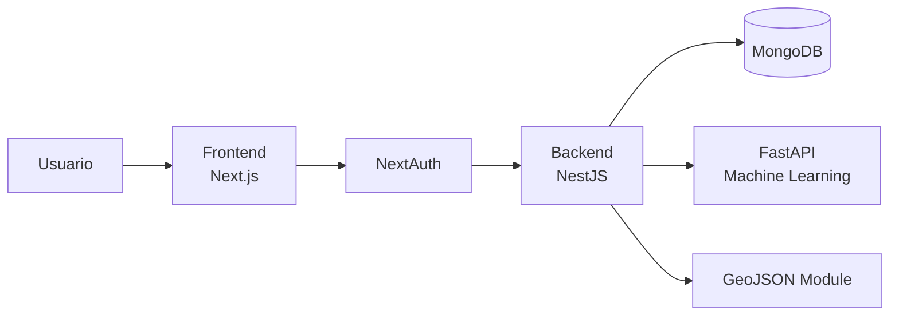
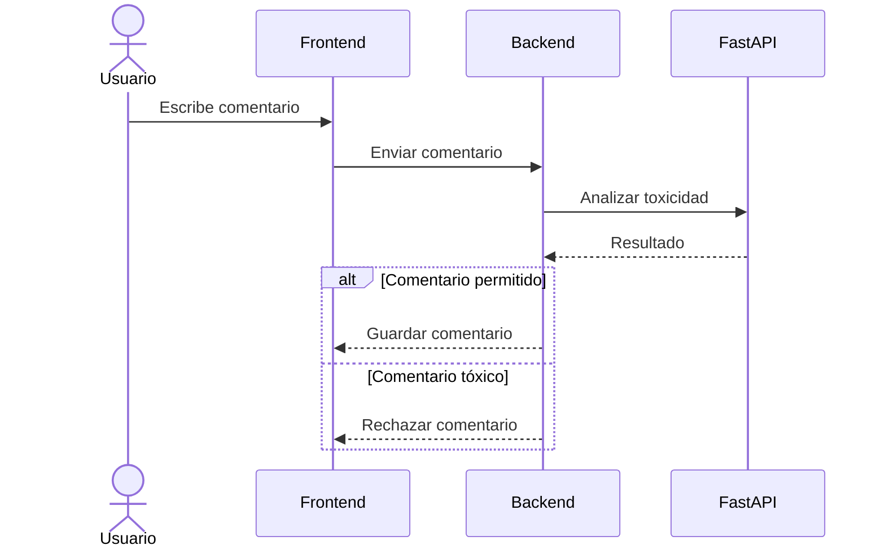
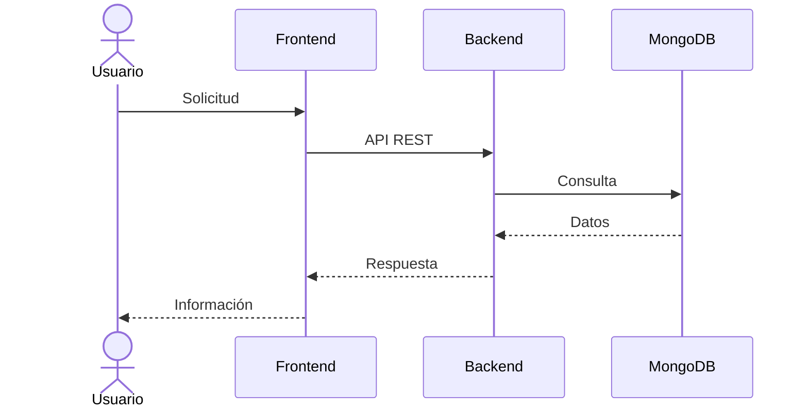
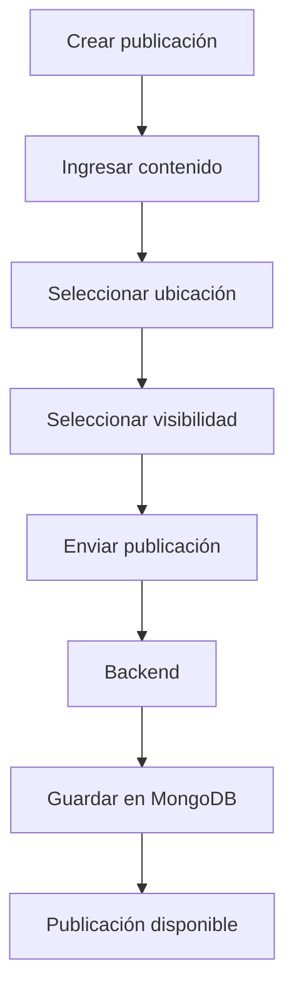
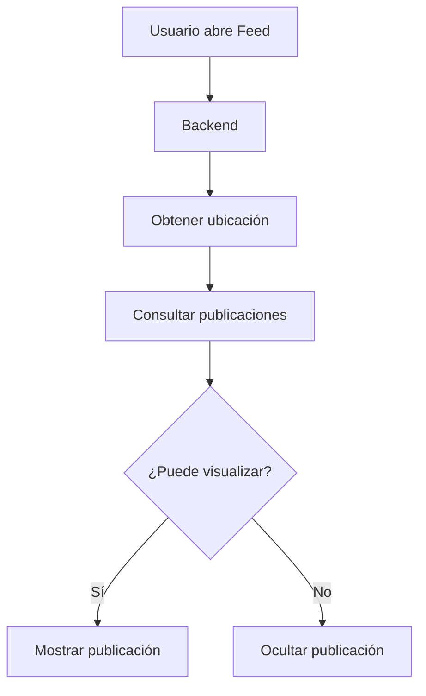
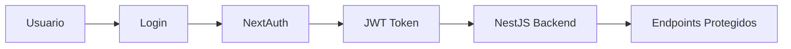
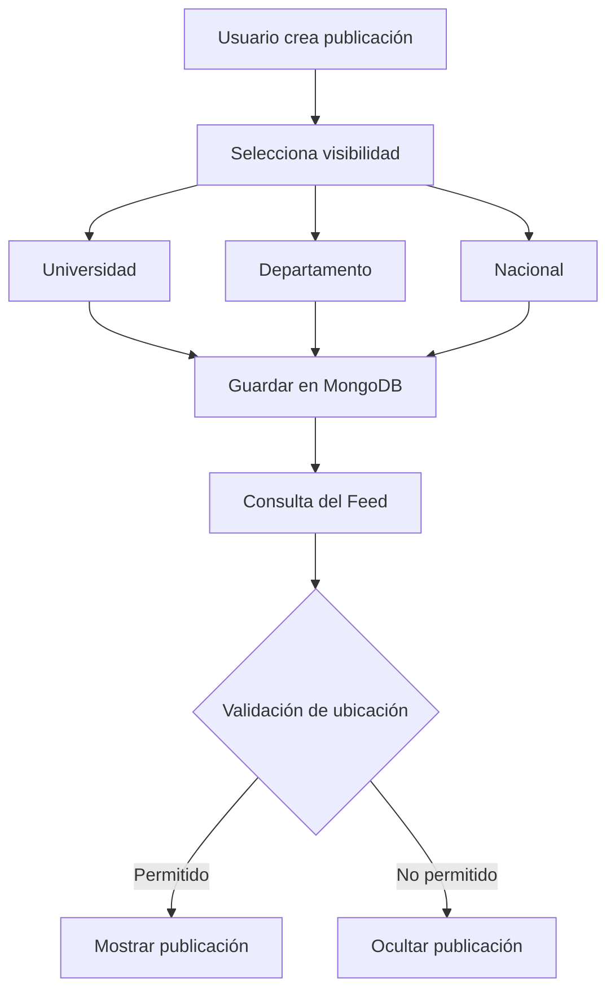

# Arquitectura

## Visión General

ElephanTalk implementa una arquitectura distribuida basada en microservicios, permitiendo separar responsabilidades entre la interfaz de usuario, la lógica de negocio, el procesamiento de Machine Learning y la gestión de datos geográficos.

Esta arquitectura facilita el mantenimiento del sistema, mejora la escalabilidad y permite incorporar nuevas funcionalidades sin afectar los componentes existentes.

---

## Arquitectura General

> Sustituya la siguiente imagen por el diagrama oficial de arquitectura del proyecto.

---

## Componentes del Sistema

---

## Componentes Principales

### Frontend

El frontend está desarrollado utilizando **Next.js**, proporcionando una interfaz moderna y responsiva para los usuarios.

Entre sus responsabilidades se encuentran:

- Registro e inicio de sesión.
- Visualización del feed.
- Creación de publicaciones.
- Administración del perfil.
- Gestión de ubicación.
- Selección de visibilidad geográfica.
- Comunicación con la API REST.

---

### Backend

El backend fue desarrollado utilizando **NestJS**.

Es el encargado de centralizar la lógica del sistema.

Entre sus funciones destacan:

- Gestión de autenticación.
- Administración de usuarios.
- Administración de publicaciones.
- Validación de permisos.
- Restricción geográfica.
- Comunicación con MongoDB.
- Comunicación con FastAPI.

---

### Base de Datos

MongoDB almacena toda la información utilizada por la plataforma.

Entre las principales colecciones se encuentran:

- Usuarios
- Publicaciones
- Comentarios
- Restricciones geográficas
- Universidades
- Departamentos

La base de datos también incorpora índices geoespaciales para optimizar consultas relacionadas con ubicación.

---

### Microservicio de Machine Learning

ElephanTalk incorpora un microservicio independiente desarrollado con **FastAPI**.

Su función consiste en analizar automáticamente los comentarios enviados por los usuarios para detectar lenguaje tóxico antes de ser publicado.

---

### GeoJSON Module

El módulo GeoJSON permite determinar la ubicación geográfica asociada a un usuario y aplicar restricciones de visibilidad sobre las publicaciones.

Este módulo aprovecha consultas geoespaciales mediante índices **2dsphere** de MongoDB.

Entre sus responsabilidades se encuentran:

- Determinar departamento.
- Determinar municipio.
- Determinar universidad.
- Resolver ShapeID.
- Validar restricciones.

---

## Flujo General de una Solicitud

---

## Flujo de Publicación

Cuando un usuario crea una publicación, el sistema ejecuta el siguiente proceso.

---

## Flujo de Consulta del Feed

Cada vez que un usuario accede al feed, el backend valida automáticamente las restricciones configuradas para cada publicación.

---

## Arquitectura de Seguridad

La autenticación en ElephanTalk se basa en JWT y NextAuth, garantizando el acceso seguro a los recursos protegidos del sistema.

El backend valida el token en cada solicitud antes de permitir el acceso a los recursos.

---

## Arquitectura de la Funcionalidad de Visibilidad Geográfica

La funcionalidad de visibilidad geográfica permite controlar quién puede ver una publicación según su ubicación.

---

## Escalabilidad

La arquitectura implementada permite incorporar nuevas funcionalidades sin afectar el funcionamiento de los componentes existentes.

Algunas posibles extensiones futuras incluyen:

- Nuevos niveles de visibilidad.
- Integración con nuevos proveedores de geolocalización.
- Nuevos modelos de Machine Learning.
- Caché distribuido.
- Balanceo de carga.
- Nuevos microservicios.

---

## Ventajas de la Arquitectura

La arquitectura seleccionada proporciona múltiples beneficios.

- Separación de responsabilidades.
- Escalabilidad.
- Mantenimiento sencillo.
- Modularidad.
- Integración mediante API REST.
- Independencia del modelo de Machine Learning.
- Facilidad para incorporar nuevas funcionalidades.

---

## Navegación

Continúe con la sección **Tecnologías**, donde se describen las herramientas utilizadas durante el desarrollo del proyecto.