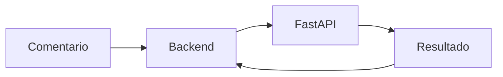
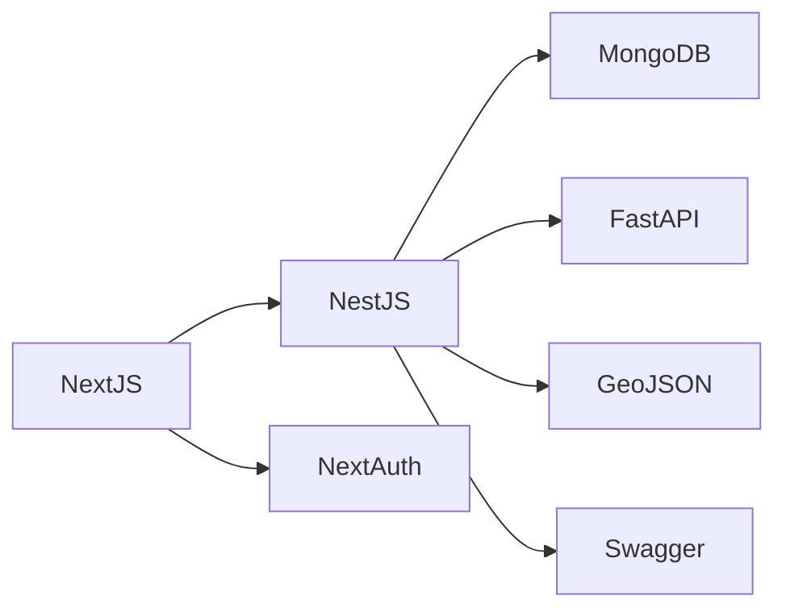

# Tecnologías

## Introducción

ElephanTalk fue desarrollado utilizando un conjunto de tecnologías modernas que permiten construir una aplicación web escalable, segura y modular.

Cada tecnología fue seleccionada de acuerdo con las necesidades del proyecto y la arquitectura distribuida implementada.

---

## Stack Tecnológico

| Categoría | Tecnología | Propósito |
|-----------|------------|-----------|
| Frontend | Next.js | Desarrollo de la interfaz de usuario |
| Backend | NestJS | Lógica de negocio y API REST |
| Base de Datos | MongoDB | Almacenamiento de datos |
| Machine Learning | FastAPI | Detección de comentarios tóxicos |
| Autenticación | NextAuth + JWT | Gestión de sesiones y autenticación |
| Geolocalización | GeoJSON | Procesamiento de datos geográficos |
| API Documentation | Swagger | Documentación de endpoints |
| Contenedores | Docker | Despliegue de servicios |

---

# Frontend

## Next.js

Next.js es el framework utilizado para desarrollar la interfaz web de ElephanTalk.

Entre sus principales responsabilidades se encuentran:

- Registro de usuarios.
- Inicio de sesión.
- Feed principal.
- Creación de publicaciones.
- Gestión del perfil.
- Consumo de la API REST.

### Ventajas

- Renderizado eficiente.
- Excelente organización del proyecto.
- Componentes reutilizables.
- Integración sencilla con APIs.

---

# Backend

## NestJS

NestJS constituye el núcleo del sistema.

Es responsable de:

- Gestión de usuarios.
- Autenticación.
- Publicaciones.
- Comentarios.
- Restricciones geográficas.
- Comunicación con MongoDB.
- Comunicación con FastAPI.

### Ventajas

- Arquitectura modular.
- Inyección de dependencias.
- Alta escalabilidad.
- Fácil mantenimiento.

---

# Base de Datos

## MongoDB

MongoDB almacena toda la información de la plataforma.

Entre las principales colecciones se encuentran:

- Users
- Posts
- Comments
- Universities
- Geographic Restrictions

### Características utilizadas

- Documentos BSON.
- Índices.
- Índices geoespaciales (2dsphere).
- Consultas por agregación.

---

# Machine Learning

## FastAPI

El sistema incorpora un microservicio independiente desarrollado con FastAPI.

Este servicio analiza automáticamente los comentarios enviados por los usuarios para detectar lenguaje tóxico.

### Beneficios

- Independencia del backend.
- Fácil actualización del modelo.
- Bajo acoplamiento.

---

# Autenticación

## NextAuth

NextAuth administra la autenticación de los usuarios.

Se encarga de:

- Inicio de sesión.
- Gestión de sesiones.
- Integración con JWT.

---

## JWT

JSON Web Token permite proteger los recursos del backend.

Cada solicitud autenticada incluye un token que es validado antes de ejecutar cualquier operación protegida.

---

# Geolocalización

## GeoJSON

GeoJSON permite representar información geográfica dentro del sistema.

Es utilizado para:

- Departamentos.
- Municipios.
- Universidades.
- Restricciones geográficas.

Su integración permite realizar consultas espaciales mediante MongoDB.

---

# Documentación API

## Swagger

Swagger genera automáticamente la documentación de los endpoints REST.

Permite:

- Visualizar rutas.
- Ejecutar pruebas.
- Revisar parámetros.
- Consultar respuestas.

---

# Contenedores

## Docker

Docker facilita el despliegue de la plataforma.

Cada servicio puede ejecutarse de manera independiente mediante contenedores.

Esto simplifica:

- Desarrollo.
- Pruebas.
- Producción.

---

# Comunicación entre Tecnologías

---

# Tecnologías por Componente

| Componente | Tecnología |
|------------|------------|
| Cliente Web | Next.js |
| API REST | NestJS |
| Persistencia | MongoDB |
| IA | FastAPI |
| Seguridad | JWT |
| Autenticación | NextAuth |
| Geolocalización | GeoJSON |
| Documentación | Swagger |
| Despliegue | Docker |

---

# Consideraciones

La combinación de estas tecnologías permite mantener una arquitectura desacoplada y preparada para futuras ampliaciones, facilitando la incorporación de nuevos módulos y servicios sin afectar el funcionamiento del sistema.