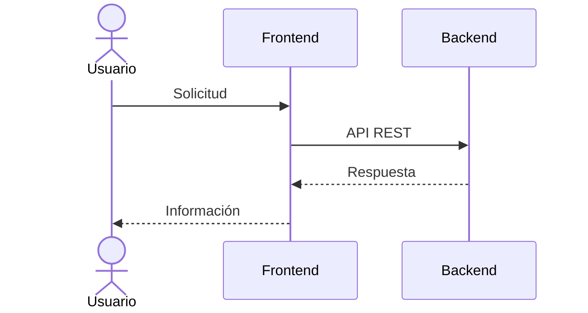

# API REST

## Introducción

El backend expone una API REST utilizada por el frontend para acceder a toda la información de la plataforma.

---

# Métodos HTTP

| Método | Uso |
|---------|-----|
| GET | Obtener información |
| POST | Crear recursos |
| PATCH | Actualizar recursos |
| DELETE | Eliminar recursos |

---

# Recursos Principales

- Usuarios
- Publicaciones
- Comentarios
- Autenticación
- Universidades
- Geolocalización

---

# Autenticación

Los endpoints protegidos requieren un token JWT válido.

---

# Swagger

La documentación de la API se genera automáticamente mediante Swagger.

Permite:

- Consultar endpoints.
- Ejecutar pruebas.
- Revisar parámetros.
- Analizar respuestas.

---

# Flujo

---

# Consideraciones

Todas las respuestas son devueltas en formato JSON.