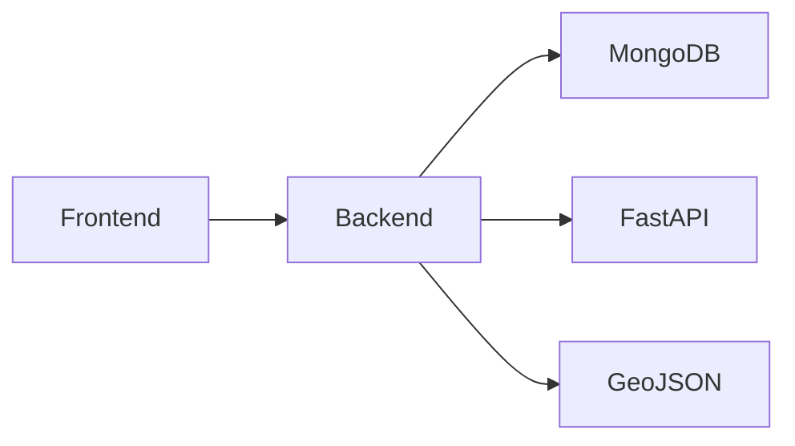

# Backend

## Introducción

El backend de ElephanTalk fue desarrollado utilizando NestJS, un framework basado en Node.js que facilita la construcción de aplicaciones escalables y mantenibles mediante una arquitectura modular.

El backend centraliza toda la lógica de negocio de la plataforma y actúa como intermediario entre el frontend, la base de datos y los servicios externos.

---

# Responsabilidades

Las principales responsabilidades del backend son:

- Gestión de usuarios.
- Autenticación y autorización.
- Gestión de publicaciones.
- Gestión de comentarios.
- Integración con Machine Learning.
- Procesamiento de geolocalización.
- Aplicación de reglas de visibilidad geográfica.
- Comunicación con MongoDB.

---

# Arquitectura



---

# Organización

El backend sigue una arquitectura modular.

```text
src/

├── auth/
├── users/
├── posts/
├── comments/
├── geojson/
├── universities/
├── common/
└── config/
```

---

# Componentes

## Controllers

Reciben las solicitudes HTTP provenientes del frontend.

Sus responsabilidades incluyen:

- Validación inicial.
- Recepción de parámetros.
- Retorno de respuestas.

---

## Services

Contienen la lógica de negocio.

Entre sus funciones destacan:

- Procesamiento de publicaciones.
- Validaciones.
- Integración con otros servicios.
- Comunicación con la base de datos.

---

## DTOs

Los Data Transfer Objects permiten validar la información recibida por la API antes de ser procesada.

---

## Guards

Protegen los endpoints mediante autenticación basada en JWT.

---

## Middlewares

Permiten ejecutar lógica previa al procesamiento de las solicitudes.

---

# Integración con Machine Learning

El backend envía cada comentario al microservicio FastAPI para determinar si contiene lenguaje tóxico antes de almacenarlo.

---

## Integración con GeoJSON

El backend consume la información geográfica proporcionada por el módulo GeoJSON para realizar consultas espaciales y aplicar las reglas de visibilidad geográfica.

La implementación detallada de este componente se describe en la sección **GeoJSON** de este manual.

---

# Visibilidad Geográfica

La versión 3A incorpora reglas adicionales para determinar qué publicaciones pueden visualizarse.

Antes de devolver una publicación, el backend verifica:

- Universidad.
- Departamento.
- Nivel nacional.

---

# Consideraciones

La arquitectura modular facilita el mantenimiento y permite incorporar nuevas funcionalidades sin afectar el resto del sistema.