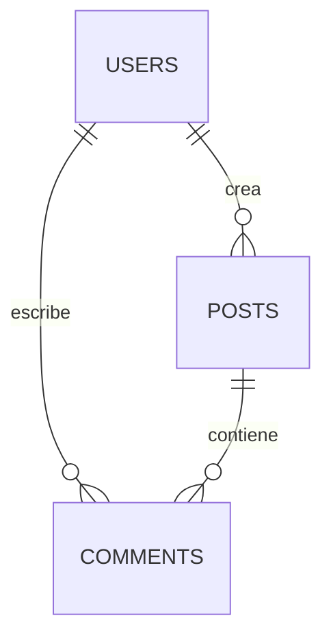

# Base de Datos

## Introducción

ElephanTalk utiliza MongoDB como sistema gestor de base de datos.

Su modelo basado en documentos permite almacenar información de forma flexible y escalable.

---

# Colecciones Principales

- Users
- Posts
- Comments
- Universities
- GeoJSON

---

# Relación General

---

# Publicaciones

Cada publicación almacena información relacionada con:

- Autor.
- Contenido.
- Fecha.
- Ubicación.
- Restricciones geográficas.

---

# Usuarios

Cada usuario almacena:

- Información personal.
- Universidad.
- Ubicación.
- Credenciales.

---

# Comentarios

Cada comentario mantiene:

- Autor.
- Publicación.
- Resultado del análisis ML.

---

# Geolocalización

MongoDB utiliza índices geoespaciales para realizar consultas de proximidad.

Esto permite:

- Buscar publicaciones cercanas.
- Aplicar filtros por ubicación.

---

# Restricciones Geográficas

La versión 3A incorpora nuevos atributos para controlar la visibilidad de las publicaciones.

Entre ellos:

- País.
- Departamento.
- Universidad.
- Restricciones.

---

# Índices

El sistema utiliza índices para mejorar el rendimiento de las consultas.

Especialmente:

- Índices geoespaciales.
- Índices por usuario.
- Índices por publicación.

---

# Consideraciones

El modelo de datos fue diseñado para facilitar futuras ampliaciones sin afectar la información previamente almacenada.