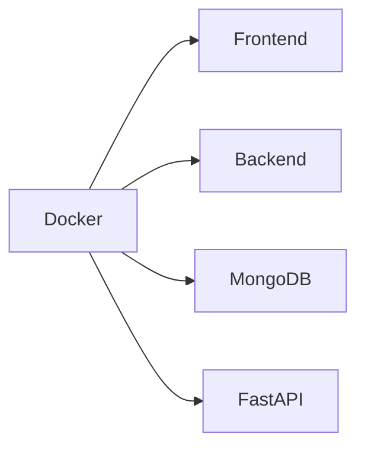

# Despliegue

## Introducción

ElephanTalk puede ejecutarse localmente o mediante contenedores Docker.

La arquitectura distribuida permite desplegar cada componente de forma independiente.

---

# Componentes

- Frontend
- Backend
- MongoDB
- FastAPI

---

# Arquitectura

---

# Variables de Entorno

Cada componente utiliza variables de entorno para configurar:

- Base de datos.
- JWT.
- URLs.
- APIs.
- Servicios externos.

---

# Proceso General

1. Clonar el repositorio.

2. Configurar variables de entorno.

3. Levantar los servicios.

4. Ejecutar migraciones (si aplica).

5. Iniciar la aplicación.

---

# Consideraciones

Se recomienda utilizar Docker para garantizar un entorno consistente entre desarrollo y producción.