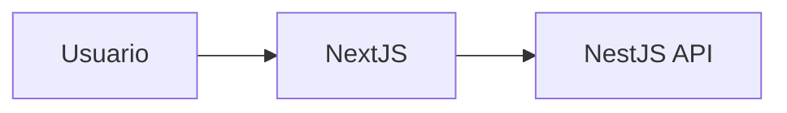
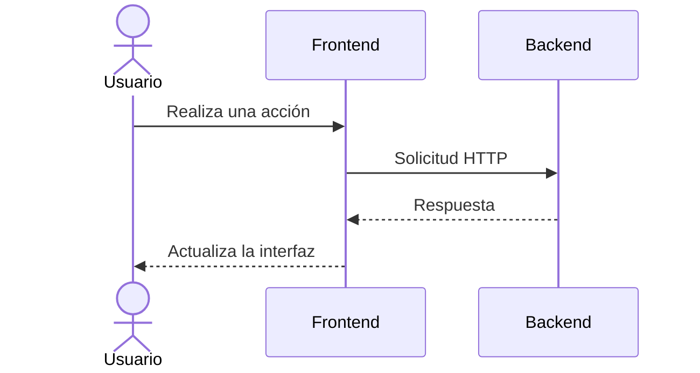

# Frontend

## Introducción

El frontend de ElephanTalk fue desarrollado utilizando **Next.js**, un framework basado en React que permite construir aplicaciones web modernas, rápidas y escalables.

Este componente es el encargado de proporcionar la interfaz gráfica con la que interactúan los usuarios, permitiendo el acceso a todas las funcionalidades de la plataforma.

---

# Responsabilidades

El frontend es responsable de:

- Registro e inicio de sesión de usuarios.
- Visualización del feed de publicaciones.
- Creación y edición de publicaciones.
- Gestión de comentarios.
- Gestión del perfil de usuario.
- Consumo de la API REST.
- Configuración de la visibilidad geográfica de las publicaciones.

---

# Arquitectura



---

# Flujo General



---

# Organización General

El proyecto frontend se encuentra organizado en distintos módulos para facilitar el mantenimiento del código.

Ejemplo de estructura:

```text
frontend/

├── app/
├── components/
├── hooks/
├── services/
├── styles/
├── public/
└── utils/
```

La organización puede variar dependiendo de la evolución del proyecto.

---

# Componentes Principales

Entre los componentes desarrollados se encuentran:

- Página de inicio.
- Inicio de sesión.
- Registro.
- Feed principal.
- Publicaciones.
- Comentarios.
- Perfil de usuario.
- Configuración.

---

# Comunicación con el Backend

Toda la información mostrada por la aplicación es obtenida mediante solicitudes HTTP hacia la API desarrollada en NestJS.

Las principales operaciones incluyen:

- Obtener publicaciones.
- Crear publicaciones.
- Actualizar publicaciones.
- Eliminar publicaciones.
- Obtener comentarios.
- Registrar usuarios.
- Iniciar sesión.

---

# Integración de Geolocalización

Desde la versión 2, el frontend permite asociar una ubicación a cada publicación.

Esta información es enviada al backend para ser almacenada y utilizada en las consultas geográficas.

---

# Integración de Visibilidad Geográfica

La versión 3A incorpora un nuevo componente dentro del formulario de creación de publicaciones.

El usuario puede seleccionar uno de los siguientes niveles de visibilidad:

- Universidad.
- Departamento.
- Nacional.

Esta configuración es enviada junto con la publicación para que el backend aplique las reglas correspondientes.

---

# Manejo de Errores

El frontend informa al usuario cuando ocurre alguna situación inesperada, por ejemplo:

- Error de autenticación.
- Error de conexión.
- Datos inválidos.
- Permisos insuficientes.

---

# Consideraciones

El frontend fue diseñado para mantener una experiencia de usuario intuitiva y consistente, integrando progresivamente las nuevas funcionalidades sin afectar el funcionamiento de las versiones anteriores.