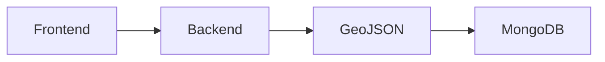
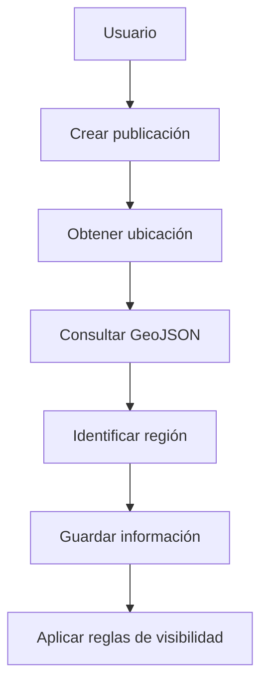

# GeoJSON

## Introducción

ElephanTalk utiliza GeoJSON para representar y procesar información geográfica dentro de la plataforma.

Esta tecnología permite almacenar datos espaciales de forma estandarizada y facilita la implementación de funcionalidades relacionadas con la geolocalización y la segmentación geográfica de las publicaciones.

Su incorporación fue fundamental para el desarrollo de las versiones 2 y 3 del proyecto.

---

# Objetivos

GeoJSON es utilizado para:

- Representar información geográfica.
- Identificar departamentos y municipios.
- Asociar publicaciones a una ubicación.
- Determinar la ubicación de los usuarios.
- Aplicar restricciones de visibilidad geográfica.

---

# Arquitectura

---

# Funcionamiento

Cuando un usuario crea una publicación o consulta el contenido disponible, el sistema utiliza la información geográfica para determinar la ubicación correspondiente.

Posteriormente, esta información es utilizada por el backend para aplicar las reglas de negocio relacionadas con la geolocalización y la visibilidad de las publicaciones.

---

# Componentes

GeoJSON almacena información relacionada con:

- Países.
- Departamentos.
- Municipios.
- Universidades.
- Coordenadas geográficas.

---

# Integración con MongoDB

MongoDB utiliza índices geoespaciales para realizar consultas eficientes sobre la información almacenada.

Esto permite:

- Buscar publicaciones cercanas.
- Identificar usuarios por ubicación.
- Aplicar filtros geográficos.
- Optimizar consultas espaciales.

---

# Integración con la Versión 2

Durante la versión 2, GeoJSON permitió incorporar la geolocalización de las publicaciones.

Las principales funcionalidades fueron:

- Asociación de coordenadas a las publicaciones.
- Visualización de publicaciones cercanas.
- Organización del contenido según la ubicación.

---

# Integración con la Versión 3

La versión 3 amplía el uso de GeoJSON al incorporar reglas de visibilidad geográfica.

La información obtenida permite determinar si un usuario puede visualizar una publicación según el nivel de segmentación configurado.

Los niveles soportados son:

- Universidad.
- Departamento.
- Nacional.

---

# Flujo General

---

# Beneficios

La utilización de GeoJSON aporta múltiples ventajas:

- Representación estandarizada de datos geográficos.
- Consultas espaciales eficientes.
- Integración con MongoDB.
- Base para funcionalidades de geolocalización.
- Soporte para restricciones geográficas.

---

# Consideraciones

La utilización de GeoJSON permitió reutilizar la infraestructura desarrollada en la versión 2 para implementar la segmentación geográfica de publicaciones en la versión 3, evitando modificaciones significativas en la arquitectura general del sistema.