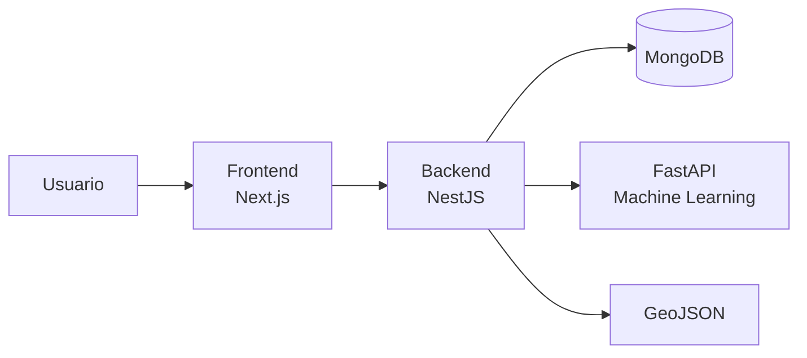
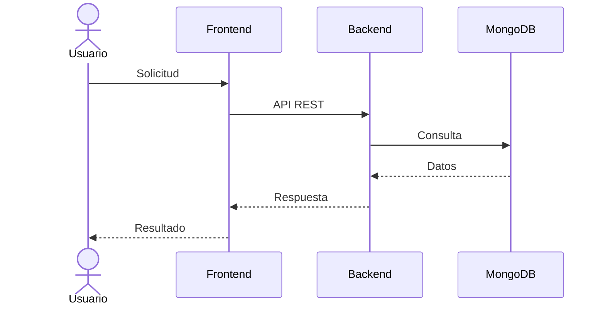

# Manual Técnico

## Introducción

El Manual Técnico de ElephanTalk describe la arquitectura, organización y funcionamiento interno del sistema.

Su propósito es facilitar la comprensión del proyecto para desarrolladores, administradores y futuros colaboradores, proporcionando una visión clara de los componentes que conforman la plataforma y la forma en que interactúan entre sí.

Esta sección está orientada a personal técnico con conocimientos en desarrollo web, arquitecturas distribuidas y servicios REST.

---

# Objetivos

El Manual Técnico tiene como objetivos principales:

- Documentar la arquitectura del sistema.
- Describir la organización del proyecto.
- Explicar la comunicación entre los distintos componentes.
- Facilitar el mantenimiento del software.
- Servir como guía para futuras ampliaciones.

---

# Arquitectura General

ElephanTalk implementa una arquitectura basada en microservicios, donde cada componente posee responsabilidades claramente definidas.

---

# Componentes

El sistema se encuentra dividido en los siguientes componentes principales.

| Componente | Descripción |
|------------|-------------|
| Frontend | Interfaz web utilizada por los usuarios. |
| Backend | Implementa toda la lógica de negocio y expone la API REST. |
| Base de Datos | Almacena la información persistente de la plataforma. |
| Machine Learning | Analiza comentarios para detectar lenguaje tóxico. |
| GeoJSON | Procesa información geográfica y restricciones espaciales. |

---

# Organización del Manual

El Manual Técnico se divide en las siguientes secciones.

## Frontend

Describe la estructura del cliente web desarrollado con Next.js.

Incluye:

- Organización del proyecto.
- Componentes.
- Páginas.
- Flujo de navegación.
- Comunicación con la API.

---

## Backend

Describe la arquitectura implementada en NestJS.

Incluye:

- Módulos.
- Controladores.
- Servicios.
- DTOs.
- Flujo de solicitudes.

---

## Base de Datos

Documenta el modelo de datos utilizado por la plataforma.

Incluye:

- Colecciones.
- Relaciones.
- Índices.
- Restricciones.
- Modelo geográfico.

---

## GeoJSON

Explica el funcionamiento del módulo encargado del procesamiento geográfico.

Incluye:

- ShapeID.
- Consultas espaciales.
- Restricciones.
- Departamentos.
- Universidades.

---

## Machine Learning

Describe el microservicio encargado de detectar comentarios tóxicos.

Incluye:

- Arquitectura.
- Comunicación.
- Flujo.
- Integración.

---

## API REST

Documenta la comunicación entre el frontend y el backend.

Incluye:

- Endpoints.
- Métodos HTTP.
- Autenticación.
- Respuestas.

---

## Seguridad

Describe los mecanismos utilizados para proteger la plataforma.

Incluye:

- JWT.
- NextAuth.
- Protección de endpoints.
- Validaciones.

---

## Despliegue

Explica cómo ejecutar el sistema.

Incluye:

- Docker.
- Variables de entorno.
- Dependencias.
- Configuración inicial.

---

# Flujo General

El siguiente diagrama resume el funcionamiento general del sistema.

---

# Consideraciones

Cada sección del Manual Técnico documenta un componente específico de la plataforma, permitiendo comprender su funcionamiento de manera independiente sin perder la visión general de la arquitectura del sistema.

Las páginas siguientes profundizan en la implementación de cada uno de estos componentes.