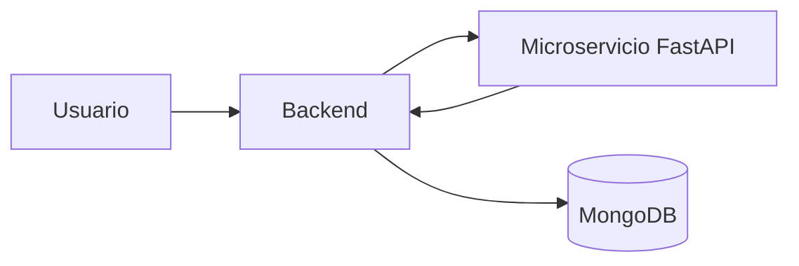

# Machine Learning

## Introducción

ElephanTalk incorpora un microservicio desarrollado con FastAPI encargado de detectar automáticamente comentarios tóxicos.

Esta funcionalidad fue introducida en la versión 1.

---

# Objetivo

Reducir la publicación de contenido ofensivo mediante inteligencia artificial.

---

# Arquitectura

---

# Flujo

1. Usuario escribe comentario.

2. Backend recibe la solicitud.

3. Se envía el comentario a FastAPI.

4. El modelo realiza la predicción.

5. FastAPI devuelve el resultado.

6. El backend decide si almacenar el comentario.

---

# Beneficios

- Automatización.
- Mayor seguridad.
- Escalabilidad.
- Independencia del modelo.

---

# Consideraciones

El modelo puede actualizarse sin modificar el backend principal.