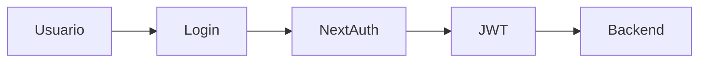

# Seguridad

## Introducción

La seguridad de ElephanTalk se basa en autenticación mediante JWT y gestión de sesiones utilizando NextAuth.

---

# Componentes

- JWT.
- NextAuth.
- Guards.
- Validaciones.

---

# Flujo

---

# Autenticación

El usuario inicia sesión mediante NextAuth.

Posteriormente recibe un JWT que será utilizado en todas las solicitudes autenticadas.

---

# Autorización

Antes de ejecutar cualquier endpoint protegido el backend verifica:

- Token.
- Expiración.
- Permisos.

---

# Beneficios

- Protección de recursos.
- Sesiones seguras.
- Arquitectura escalable.