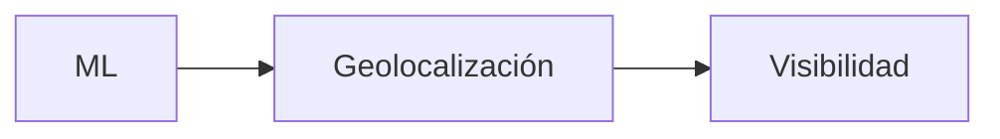

# Comparación entre Versiones

## Resumen

La siguiente tabla resume la evolución funcional de ElephanTalk.

| Funcionalidad | V1 | V2 | V3 |
|--------------|:--:|:--:|:--:|
| Moderación mediante Machine Learning | ✅ | ✅ | ✅ |
| Geolocalización | ❌ | ✅ | ✅ |
| Feed de publicaciones cercanas | ❌ | ✅ | ✅ | 
| Restricción por universidad | ❌ | ❌ | ✅ | 
| Restricción por departamento | ❌ | ❌ | ✅ |
| Restricción nacional | ❌ | ❌ | ✅ |

---

## Evolución

---

## Conclusión

Cada versión de ElephanTalk amplía las capacidades de la plataforma sin reemplazar las funcionalidades implementadas anteriormente.