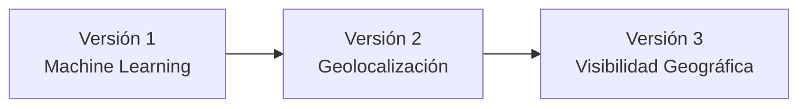

# Evolución del Proyecto

## Introducción

ElephanTalk ha evolucionado de manera incremental, incorporando nuevas funcionalidades en cada versión con el objetivo de mejorar la experiencia del usuario y ampliar las capacidades de la plataforma.

Cada versión parte de la implementación anterior y agrega nuevas características sin afectar el funcionamiento existente. A partir de la versión 2, el proyecto dio origen a dos desarrollos independientes, cada uno enfocado en resolver una problemática distinta.

---

## Línea de Evolución

---

## Resumen de Versiones

| Versión | Funcionalidad principal |
|----------|-------------------------|
| V1 | Moderación automática de comentarios mediante Machine Learning. |
| V2 | Geolocalización de publicaciones y visualización de contenido cercano. |
| V3 | Restricción de visibilidad por universidad, departamento y nivel nacional. |

---

## Objetivo de esta Sección

En las siguientes páginas se documenta la evolución funcional del proyecto, describiendo:

- Objetivos.
- Funcionalidades incorporadas.
- Arquitectura.
- Cambios realizados.
- Beneficios obtenidos.

Esto permite comprender cómo ElephanTalk evolucionó desde una plataforma básica hasta una red social inteligente con funcionalidades avanzadas.