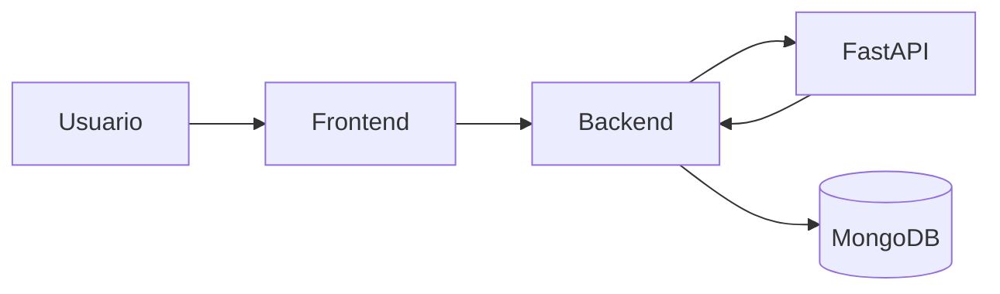
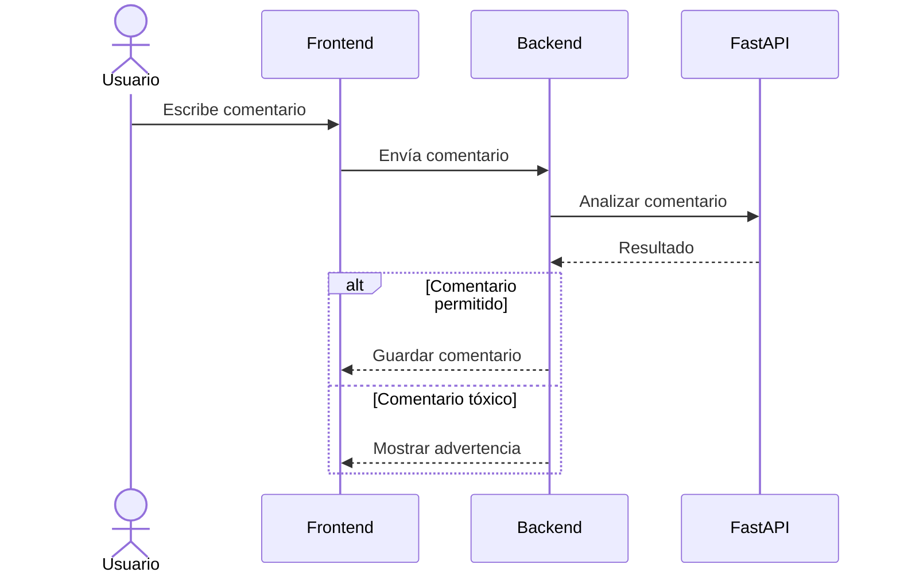

# Versión 1 - Moderación mediante Machine Learning

## Descripción General

La primera evolución importante de ElephanTalk consistió en incorporar un sistema de moderación automática de comentarios utilizando Machine Learning.

Para ello se integró un microservicio independiente desarrollado con FastAPI, encargado de analizar el contenido de cada comentario antes de almacenarlo en la plataforma.

Esta implementación permitió mejorar la calidad de las interacciones entre los usuarios sin depender completamente de la moderación manual.

---

## Objetivo

Reducir la publicación de comentarios ofensivos mediante un modelo de aprendizaje automático capaz de identificar lenguaje tóxico.

---

## Funcionalidades Implementadas

- Detección automática de comentarios tóxicos.
- Integración con un microservicio de Machine Learning.
- Comunicación entre NestJS y FastAPI.
- Bloqueo de comentarios considerados ofensivos.
- Respuesta inmediata al usuario.

---

## Arquitectura

---

## Flujo de Funcionamiento

---

## Beneficios

- Disminución de contenido ofensivo.
- Mayor seguridad para la comunidad.
- Automatización del proceso de moderación.
- Arquitectura preparada para incorporar nuevos modelos de inteligencia artificial.