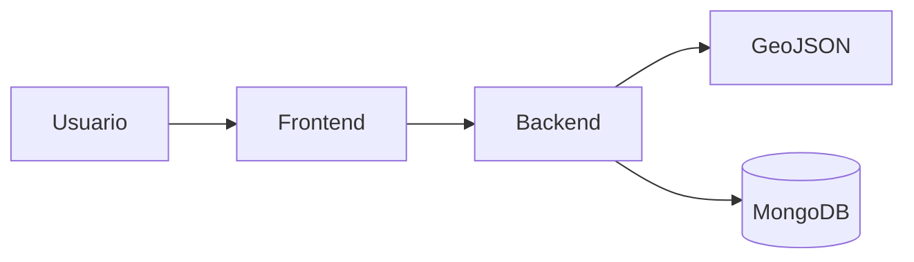
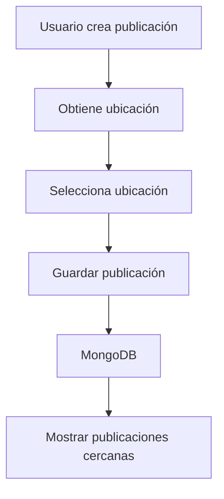
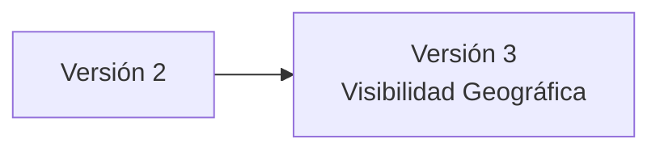

# Versión 2 - Geolocalización

## Descripción General

La segunda versión incorporó geolocalización dentro de las publicaciones, permitiendo asociar información geográfica al contenido compartido por los usuarios.

Gracias a esta implementación fue posible mostrar publicaciones cercanas y ofrecer una experiencia mucho más contextualizada.

Esta funcionalidad constituye la base sobre la cual se desarrollaron las implementaciones de la versión 3.

---

## Objetivo

Incorporar información geográfica a las publicaciones para mostrar contenido relevante según la ubicación del usuario.

---

## Funcionalidades Implementadas

- Asociación de coordenadas geográficas a publicaciones.
- Feed de publicaciones cercanas.
- Feed nacional.
- Obtención automática de ubicación.
- Integración con GeoJSON.
- Consultas geoespaciales utilizando MongoDB.

---

## Arquitectura

---

## Flujo de Funcionamiento

---

## Beneficios

- Mayor relevancia del contenido mostrado.
- Experiencia personalizada.
- Preparación para funcionalidades de segmentación geográfica.
- Optimización de consultas espaciales.

---

## Evolución del Proyecto

La infraestructura de geolocalización implementada permitió desarrollar dos nuevas ramas del proyecto.

