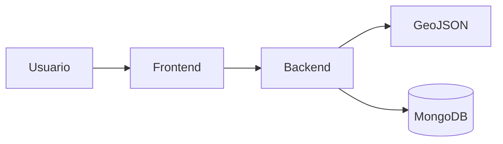
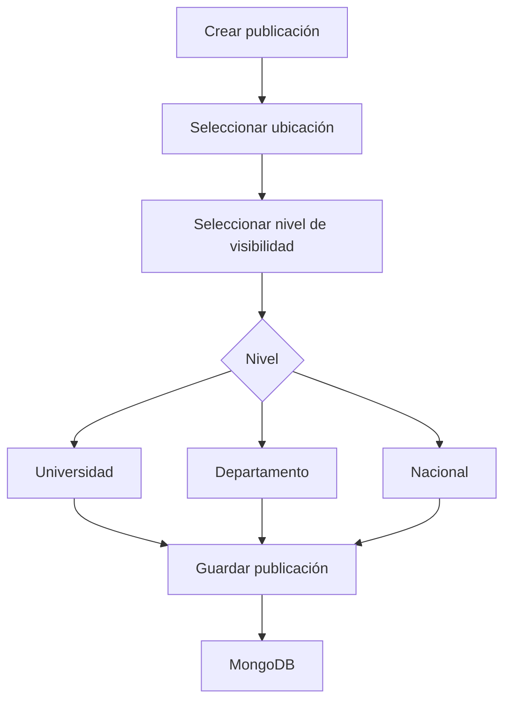
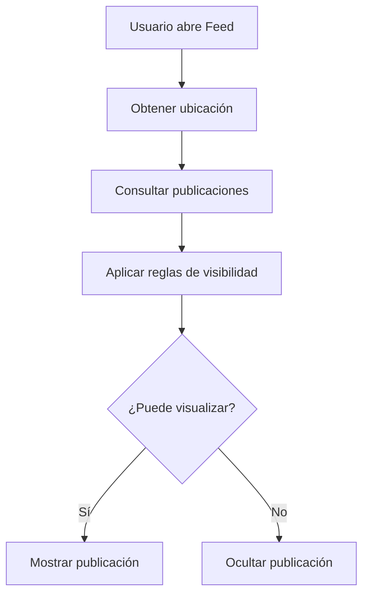

# Versión 3 - Visibilidad Geográfica

## Descripción General

La versión 3 incorpora un sistema de segmentación geográfica de publicaciones que permite controlar el alcance del contenido publicado dentro de ElephanTalk.

Hasta la versión anterior, cualquier publicación podía ser visualizada por todos los usuarios, independientemente de su ubicación geográfica. Aunque el sistema ya era capaz de asociar coordenadas a las publicaciones y mostrar contenido cercano, no existía un mecanismo para restringir quién podía visualizar dicho contenido.

Con esta implementación, el usuario puede definir el nivel de visibilidad de una publicación al momento de crearla, permitiendo que únicamente determinados usuarios puedan acceder a ella según su ubicación.

---

## Problema

Las publicaciones almacenaban información geográfica, pero esa información únicamente era utilizada para mostrar contenido cercano al usuario.

No existía una forma de indicar que una publicación debía ser visible únicamente para:

- Una universidad específica.
- Un departamento.
- Todo El Salvador.

Como consecuencia, muchas publicaciones perdían relevancia al aparecer en el feed de usuarios para quienes el contenido no estaba dirigido.

---

## Objetivo

Implementar un mecanismo de control de visibilidad basado en ubicación geográfica que permita segmentar automáticamente las publicaciones según la ubicación del usuario.

---

# Arquitectura de la Solución

La funcionalidad aprovecha la infraestructura de geolocalización implementada en la versión anterior, incorporando nuevas reglas de negocio dentro del backend.

---

# Niveles de Visibilidad

Actualmente el sistema soporta tres niveles de segmentación.

| Nivel | Descripción |
|--------|-------------|
| Universidad | Visible únicamente para usuarios pertenecientes a una universidad determinada. |
| Departamento | Visible para usuarios ubicados dentro de un departamento específico. |
| Nacional | Visible para cualquier usuario dentro de El Salvador. |

La opción **Nacional** se establece como valor predeterminado durante la creación de una publicación.

---

# Flujo de Creación de una Publicación

---

# Flujo de Consulta del Feed

Cada vez que un usuario accede al feed, el backend valida automáticamente las restricciones configuradas para cada publicación.

---

# Cambios Realizados

## Frontend

Se realizaron modificaciones en la interfaz para permitir seleccionar el nivel de visibilidad durante la creación de una publicación.

Entre los cambios destacan:

- Nuevo selector de visibilidad.
- Validación de opciones disponibles.
- Envío de la configuración al backend.
- Actualización del formulario de creación.

---

## Backend

El backend fue modificado para incorporar las nuevas reglas de negocio.

Las principales modificaciones incluyen:

- Validación del nivel de visibilidad.
- Persistencia de la configuración.
- Filtrado automático del feed.
- Validación de permisos antes de retornar publicaciones.

---

## Base de Datos

El modelo de publicaciones fue extendido para almacenar la configuración de visibilidad.

Entre los nuevos atributos destacan:

| Campo | Descripción |
|--------|-------------|
| isGlobal | Indica si la publicación es visible a nivel nacional. |
| restrictions | Lista de restricciones geográficas asociadas. |
| country | País asociado a la publicación. |
| city | Ciudad o departamento asociado. |
| location | Coordenadas geográficas. |

---

# Integración con GeoJSON

La funcionalidad utiliza el módulo GeoJSON para determinar automáticamente la región geográfica correspondiente a cada usuario.

Esto permite:

- Identificar departamentos.
- Identificar municipios.
- Identificar universidades.
- Aplicar restricciones geográficas.

---

# Criterios de Aceptación

La implementación cumple los siguientes criterios:

- Configuración del nivel de visibilidad.
- Persistencia correcta de la información.
- Validación desde el backend.
- Filtrado automático del contenido.
- Integración con la arquitectura existente.
- Compatibilidad con publicaciones anteriores.

---

# Beneficios

La incorporación del sistema de segmentación geográfica ofrece diversas ventajas.

- Mayor privacidad.
- Contenido más relevante.
- Mejor organización de comunidades.
- Aprovechamiento de la infraestructura existente.
- Arquitectura preparada para futuras ampliaciones.

# Conclusión

La versión 3 representa una evolución natural de la funcionalidad de geolocalización incorporada en la versión anterior.

Gracias a esta implementación, ElephanTalk deja de utilizar la ubicación únicamente como un mecanismo de consulta y comienza a emplearla como parte de las reglas de negocio, permitiendo ofrecer contenido mucho más contextualizado y mejorando significativamente la experiencia de los usuarios.